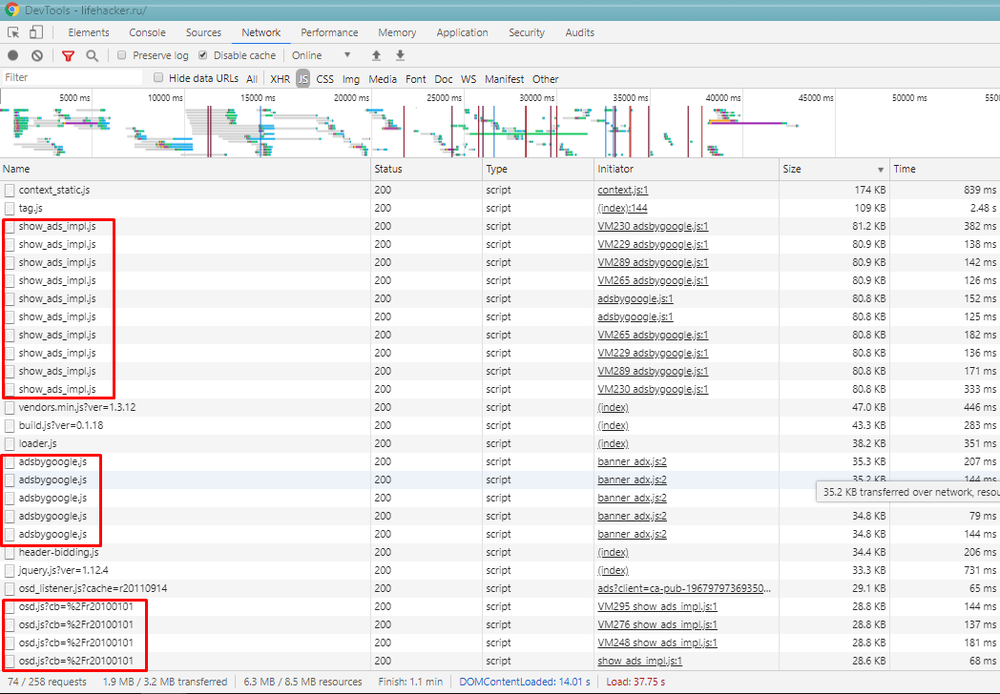
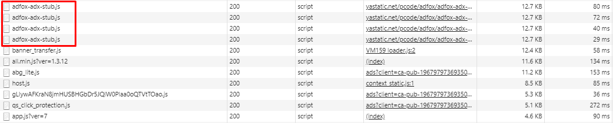
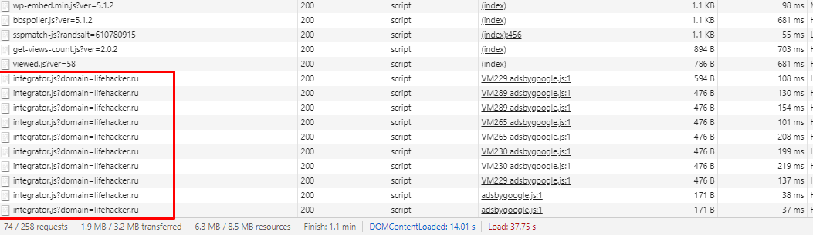
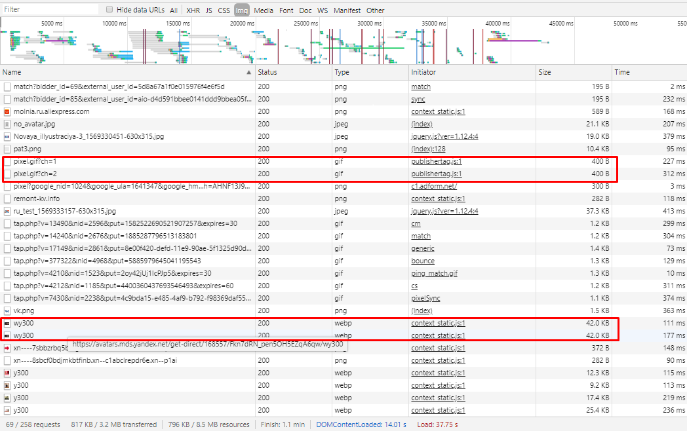
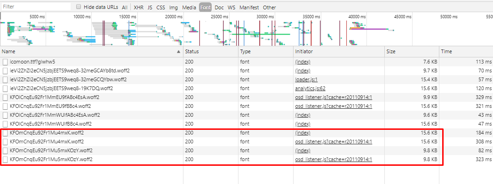
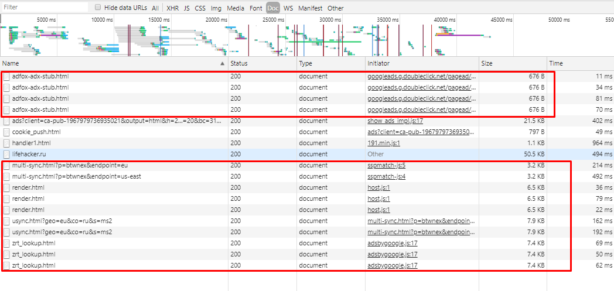
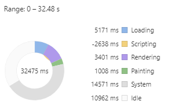
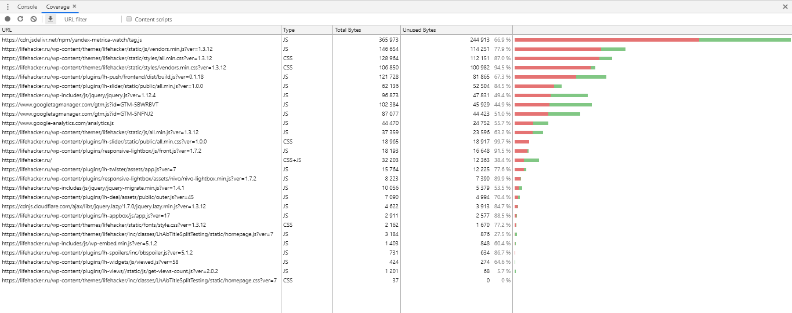

# website-analysis
Анализ загрузки сайта lifehacker.ru в Chrome DevTools по вкладкам Network, Performance, Coverage

### Network

#### Дублирование ресурсов

**Javascript:**

**Images:**

**Fonts:**

**Doc:**

 

 

 

### Perfomance
* Профиль загрузки страницы сохранен в файле `Profile-20190925T000853.json`
* Время в миллисекундах от начала навигации до событий First Paint, First Meaningful Paint, DOM Content Loaded, Load:
`First Paint - 2592.0 ms`
`First Meaningful Paint - 6464.0 ms`
`DOMContentLoaded Event - 12369.0 ms`
`Onload Event - 26983.0 ms`
* Время в миллисекундах на разные этапы обработки документа (Loading, Scripting, Rendering, Painting):  

    

### Coverage
* Cкриншот вкладки после загрузки страницы: 
    
* Объём неиспользованного CSS в ходе загрузки страницы: `233,72 Кб`
* Объём неиспользованного JS в ходе загрузки страницы: `735,89 Кб`

